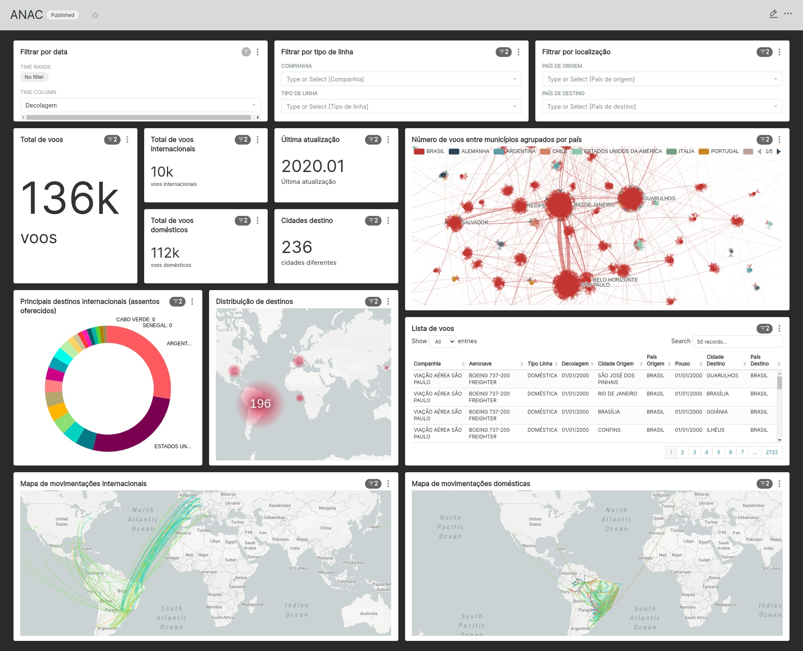

# Extraction, streaming and visualization of ANAC open database

<p>


</p>

ANAC (*Agência Nacional de Aviação Civil*, brazilian National Civil Aviation Agency) presents monthly data about civil flights since 2000 to now. In this project, this data is extracted and stored in a staging folder in GCS to be processed in streaming and finally visualized with a dashboard. To do it, Apache Airflow its used to make the monthly extractions and trigger Spark jobs to do the transformantions in the data. To visualize the data, we mirror the processed data also stored in GCS to BigQuery and present a dashboard with Apache Superset. Also, the GCS and BigQuery environments are provided with Terraform while the restant of techs runs locally with docker containers.

About the data, the files distributed by ANAC are *zip* files with *txt* in *csv* format. In the extractions, only the year and month values the base url are changed based on monthly DAG runs. In example, to download the data from january of 2000, we have to `curl` the base url with suffix `basica2000-01.zip`. Next, the zip file is uncompressed and the *txt* is uploaded to GCS in `raw_data` folder. This procedure is realized by the **ExtractionDAG**.

The **StreamingDAG** runs the Spark jobs (with PySpark) first creating a `dim_datas` table with static data about time and then starts the streaming jobs. Each streaming job creates a table grouping columns with related data that will be mirror in BigQuery. At the end, the tables in BigQuery are:

- dim_aerodromos
- dim_digito_identificador
- dim_empresas
- dim_equipamentos
- dim_datas
- fact_voos

## How to use this repo

First, create a virtual environment and install the dotenv to dont mess your own environment:

```shell
# it will install virtualenv with pip and create a virtual environment in ./venv
make init
# enter in the virtual environment
source ./venv/bin/activate
# install project dependencies
pip install -r requirements.txt
```

So, the following environment variables need to be defined and propagated to the docker containers. A descriptions of they can be viewed running `make help`:

- BQ_DATASET: dataset ID to upload the data in BigQuery
- BQ_VIEWS: dataset ID to mirror the data in BigQuery
- GOOGLE_CLOUD_PROJECT: project name with the GCS bucket and BigQuery dataset
- GCS_BUCKET: bucket name in Cloud Storage

After set the project names you can call a bash with the environment variables like this:

```shell
dotenv run /bin/bash
```

Each one of the directories `airflow`, `terraform`, `spark` and `superset` contain a compose file and a Makefile to help to manipulate the containers with different proposes. The first step is set the cloud environment with `terraform`.

### Terraform

Build the terraform environment to apply the resources. It will generate a GCS bucket and two BigQuery datasets: the first one to mirror the data in GCS and second, to mirror the first dataset to external access.

```shell
cd terraform
# build the images
make build
# start the container
make start
# login into your gcloud account
make gcloud
# enter in docker shell
make shell
```

So, for now, just apply the storage resource. The bigquery resources can be applyable only when some data is there in the lake.

```shell
# apply bucket creation
terraform apply gcp/storage

# apply bigquery data warehouse dataset and views
terraform apply gcp/bigquery
```

### Apache Airflow and Spark

First, create a network to connect Apache Airflow and Spark docker services. So, build the Spark and Apache Airflow containers and start both ExtractionDAG and StreamingDAG. You can check the Airflow UI in http://localhost:8080 and Spark UI in http://localhost:8888.

```shell
# alias to docker network create airport_streaming
make network

# build spark and airflow containers
make stream-build
# get up the containers
make stream-up
# login into gcloud
make stream-login
```

The DAGs ExtractionDAG and StreamingDAG are described as the following images:

<p align="center"></p>
<p align="center"></p>

### Superset

Once the DAGs have filled the tables in BigQuery, you can check the dashboard in Superset. To do it, you need to build the Superset container. To check Superset UI you can access http://localhost:8000:

```shell
cd superset
make build
make start
make gcloud
```

Finally, to import the presented dashboard you can enter in superset container and run:

```shell
# to enter in the container shell
make shell

# import configs
superset import-dashboards -p /opt/superset/dashboard.json
superset import-datasources -p /opt/superset/fact_voos_geo_location.yaml
```



## References

- Micro data base url: https://www.gov.br/anac/pt-br/assuntos/regulados/empresas-aereas/envio-de-informacoes/microdados
- Column descriptions: https://www.anac.gov.br/assuntos/setor-regulado/empresas/envio-de-informacoes/descricao-de-variaveis
